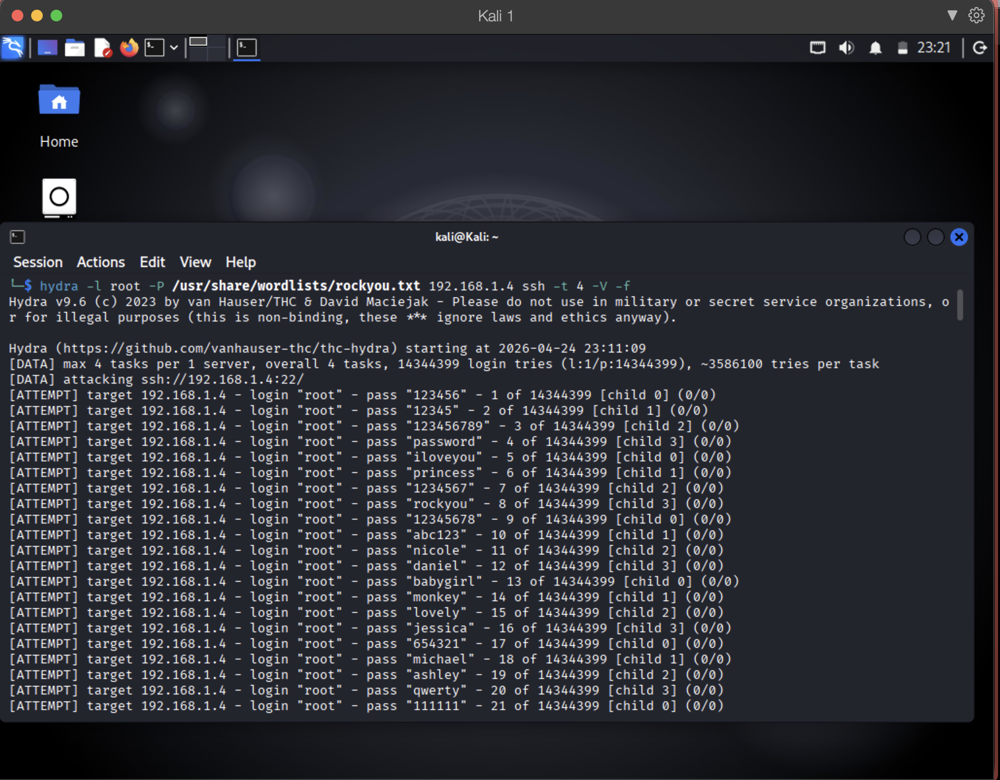
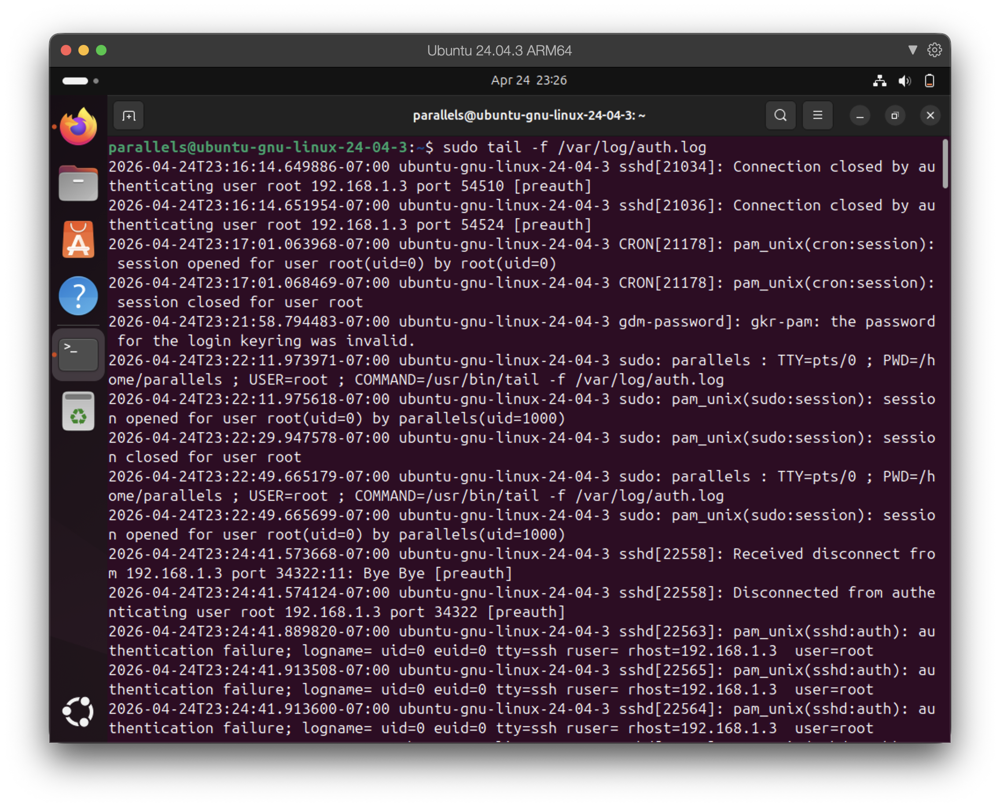
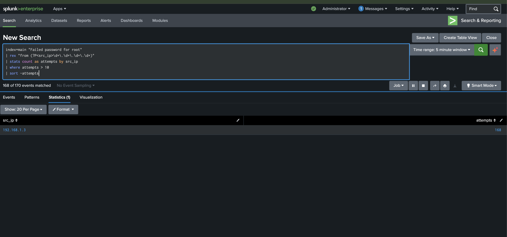

# SSH Brute Force Detection with Splunk SIEM

**Author:** Marlon Michaud  
**Date:** April 24, 2026  
**Category:** Incident Response | Threat Detection | SIEM  

---

## Objective

Simulate an SSH brute force attack against a Linux host and detect it in real time using a home SIEM lab built with Splunk Enterprise.

---

## Lab Environment

| Role | System | Details |
|------|--------|---------|
| SIEM | macOS M4 (Host) | Splunk Enterprise 10.2.2 |
| Victim | Ubuntu 24.04 ARM64 | IP: 192.168.1.4 |
| Attacker | Kali Linux | IP: 192.168.1.3 |

**Log forwarding:** rsyslog → UDP 514 → Splunk  
**Logs monitored:** `/var/log/syslog`, `/var/log/auth.log`

---

## Attack Simulation

**Tool:** Hydra v9.6  
**Command:**
```bash
hydra -l root -P /usr/share/wordlists/rockyou.txt 192.168.1.4 ssh -t 4 -V -f
```

**What this does:** Launches a dictionary attack against the SSH service on the victim machine, attempting to authenticate as `root` using 14 million passwords from the rockyou wordlist at 4 concurrent threads.

### Screenshot: Hydra attack running on Kali


---

## Detection

### Log Evidence

Ubuntu's `auth.log` captured every failed attempt in real time:

```
sshd[20861]: Failed password for root from 192.168.1.3 port 49982 ssh2
sshd[20866]: Failed password for root from 192.168.1.3 port 49990 ssh2
sshd[20860]: Failed password for root from 192.168.1.3 port 49970 ssh2
```

### Screenshot: auth.log flooded with failed SSH attempts


---

## Splunk Detection Query

```spl
index=main "Failed password for root"
| rex "from (?P<src_ip>\d+\.\d+\.\d+\.\d+)"
| stats count as attempts by src_ip
| where attempts > 10
| sort -attempts
```

**What this does:**
- Searches auth logs for failed root login attempts
- Extracts the source IP using regex
- Counts total attempts per IP
- Filters for IPs exceeding 10 attempts (brute force threshold)
- Sorts by highest attempt count

### Screenshot: Splunk detection result



---

## Findings

| Field | Value |
|-------|-------|
| Attacker IP | 192.168.1.3 |
| Target Account | root |
| Total Attempts | 168 |
| Timeframe | 5 minutes |
| Tool Identified | Hydra (multi-threaded — simultaneous connections across multiple ports) |

**Assessment:** 168 failed SSH login attempts from a single source IP within a 5-minute window is consistent with automated brute force tooling. The pattern of simultaneous connections across multiple ports confirms multi-threaded attack tool usage. A single Splunk SPL query was sufficient to attribute all activity to one attacker IP.

---

## Incident Response Actions

**1. Contain — Block the attacker IP:**
```bash
sudo ufw deny from 192.168.1.3 to any port 22
```

**2. Investigate — Check for any successful logins from the same IP:**
```spl
index=main "Accepted password" OR "Accepted publickey" "192.168.1.3"
```

**3. Harden — Disable root SSH login and deploy fail2ban:**
```bash
# Disable root login via SSH
sudo sed -i 's/PermitRootLogin yes/PermitRootLogin no/' /etc/ssh/sshd_config
sudo systemctl restart ssh

# Install fail2ban to auto-block brute force attempts
sudo apt install fail2ban -y
sudo systemctl enable fail2ban
sudo systemctl start fail2ban
```

**4. Document:** Record timeline, attacker IP, attempt count, and all remediation steps in incident report.

---

## Lessons Learned

- Default Ubuntu SSH configuration permits root login — this should be disabled in any production environment
- 168 attempts in 5 minutes would trigger most enterprise IDS/IPS rules automatically
- Centralized SIEM log collection via rsyslog provides real-time visibility across hosts
- A single SPL query was sufficient to detect, attribute, and quantify the attack

---

## Tools Used

| Tool | Purpose |
|------|---------|
| Splunk Enterprise 10.2.2 | SIEM and log analysis |
| Hydra v9.6 | SSH brute force simulation |
| rsyslog | Log forwarding to Splunk |
| rockyou.txt | Password wordlist |
| Ubuntu 24.04 ARM64 | Victim machine |
| Kali Linux | Attacker machine |

---

*Part of an ongoing home lab series building practical incident response skills. More writeups at [github.com/offensivesecguru](https://github.com/offensivesecguru)*
